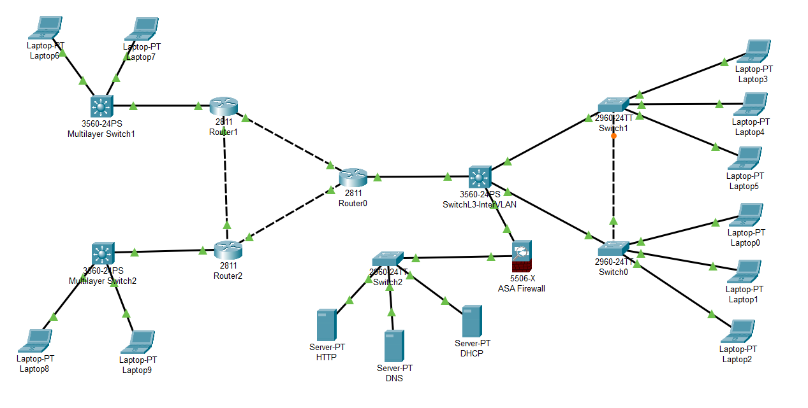
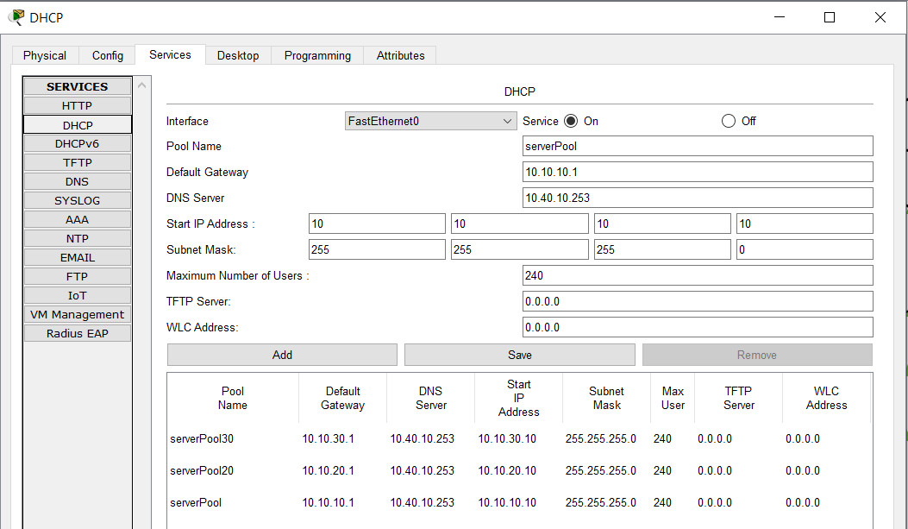

# 🏢 Enterprise Multi-Site Network

## 📝 Opis projektu
Zaawansowana symulacja sieci korporacyjnej wielooddziałowej z pełną segmentacją bezpieczeństwa, dynamicznym routingiem oraz dedykowaną infrastrukturą serwerową. Projekt demonstruje umiejętności na poziomie **CCNA**:

✅ Hierarchiczny design sieci (Core → Distribution → Access)  
✅ Segmentacja departamentów (VLAN 10, 20, 30)  
✅ Dynamiczny routing (OSPF Multi-Area)  
✅ Centralizacja bezpieczeństwa (ASA 5506-X Firewall)  
✅ Infrastruktura serwerowa (DNS, DHCP, HTTP)  
✅ Inter-VLAN Routing przez Switch L3  
✅ DHCP Relay (IP Helper Address)

---

## 🏗️ Architektura sieci



### Podział logiczny sieci:

#### 🔵 **Prawa strona – Strefa VLAN (Departamenty)**
Sieć użytkowników końcowych podzielona na 3 departamenty:
- **VLAN 10 – Sprzedaż** (Sales Department)
- **VLAN 20 – Finanse** (Finance Department)  
- **VLAN 30 – IT** (IT Department)

Każdy VLAN ma dedykowane hosty podłączone przez switch dostępowy (2960-24TT).

#### 🟢 **Centrum – Strefa Serwerowa + Firewall**
- **ASA 5506-X Firewall:** Kontrola ruchu między strefami (Inside/Outside).
- **Switch 2960-24TT (Switch2):** Agregacja serwerów.
- **Serwery:**
  - `Server-PT DHCP` – Automatyczna alokacja IP dla wszystkich VLANów
  - `Server-PT DNS` – Rozwiązywanie nazw domenowych
  - `Server-PT HTTP` – Strona intranet/portal korporacyjny

#### 🔴 **Lewa strona – Strefa WAN/OSPF (Oddziały)**
Symulacja wielooddziałowej sieci WAN:
- **3x Router 2811** połączone w topologii mesh/partial mesh
- **OSPF (Open Shortest Path First)** – Dynamiczny routing między lokacjami
- Switche L2 (3560-24PS) dla lokalnych hostów (laptopy statyczne)

#### 🔶 **Switch L3 (3560-24PS) – Rdzeń sieci**
Łączy wszystkie strefy, realizuje **Inter-VLAN Routing** (SVI – Switched Virtual Interfaces) oraz **DHCP Relay** dla przekazywania żądań DHCP.

---

## 📊 Plan Adresacji IP

### 🔹 Strefa VLAN (Prawa strona)

| VLAN ID | Nazwa | Podsieć | Gateway (SVI na L3) | DHCP Pool Start | Hosty |
|---------|-------|---------|---------------------|-----------------|-------|
| **10** | Sprzedaż | `10.10.10.0/24` | `10.10.10.1` | `10.10.10.11 - 10.10.10.250` | Laptop0, Laptop3 |
| **20** | Finanse | `10.10.20.0/24` | `10.10.20.1` | `10.10.20.11 - 10.10.20.250` | Laptop1, Laptop4 |
| **30** | IT | `10.10.30.0/24` | `10.10.30.1` | `10.10.30.11 - 10.10.30.250` | Laptop2, Laptop5 |

**Konfiguracja Switch L3 (kluczowa dla DHCP):**
```cisco
interface Vlan10
 ip address 10.10.10.1 255.255.255.0
 ip helper-address 10.40.10.254
!
interface Vlan20
 ip address 10.10.20.1 255.255.255.0
 ip helper-address 10.40.10.254
!
interface Vlan30
 ip address 10.10.30.1 255.255.255.0
 ip helper-address 10.40.10.254
```
### 🔹 Strefa Serwerowa (Centrum)

| Urządzenie | IP Address | Subnet | Gateway | Usługa | Opis |
|------------|-----------|--------|---------|--------|------|
| **Server DHCP** | `10.40.10.254` | `/24` | `10.40.10.1` | DHCP | Obsługuje 3 pule (VLAN 10/20/30) |
| **Server DNS** | `10.40.10.253` | `/24` | `10.40.10.1` | DNS | Rozwiązuje nazwy (np. `intranet.local`) |
| **Server HTTP** | `10.40.10.252` | `/24` | `10.40.10.1` | WWW | Portal intranetowy |
| **Switch2** | `10.40.10.2` | `/24` | - | Zarządzanie | Agregacja serwerów |

**ASA 5506-X Interfaces:**
- **Inside:** `10.40.10.1/24` (Strefa serwerowa – połączenie do Switch2)
- **Outside:** `203.0.113.1/30` (Symulacja WAN/Internet)

**Konfiguracja DHCP (Serwer):**



- **Pool `serverPool` (VLAN 10):** Gateway `10.10.10.1`, DNS `10.40.10.254`, Start IP `.11`
- **Pool `serverPool20` (VLAN 20):** Gateway `10.10.20.1`, DNS `10.40.10.254`, Start IP `.11`
- **Pool `serverPool30` (VLAN 30):** Gateway `10.10.30.1`, DNS `10.40.10.254`, Start IP `.11`
- Subnet Mask: `255.255.255.0`, Max Users: `240` per VLAN

---

### 🔹 Strefa WAN/OSPF (Lewa strona)

| Router | Interface | IP Address | Połączenie | OSPF Area |
|--------|-----------|-----------|------------|-----------|
| **Router0** | G0/0 | `172.16.0.1/30` | Router1 G0/0 | Area 0 |
| **Router0** | G0/1 | `172.16.1.1/30` | Router2 G0/0 | Area 0 |
| **Router1** | G0/1 | `172.16.2.1/30` | Router2 G0/1 | Area 0 |
| **Router1** | G0/2 | `192.168.100.1/24` | LAN (Laptopy) | - |
| **Router2** | G0/2 | `192.168.200.1/24` | LAN (Laptopy) | - |

**Laptopy statyczne (WAN side):**
- Laptop6, Laptop7: `192.168.100.x/24`
- Laptop8, Laptop9: `192.168.200.x/24`

---

## ⚙️ Zaimplementowane funkcje

### 🌐 Routing
- **OSPF (Process ID 1):** Area 0 (Backbone) między 3 routerami
- **Inter-VLAN Routing:** Switch L3 routuje między VLANami przez SVI
- **DHCP Relay:** `ip helper-address` przekazuje żądania DHCP do serwera

### 🔐 Bezpieczeństwo (ASA)
- **ACL:** Kontrola ruchu między strefami (np. VLAN → Serwery, blokada Inter-VLAN)
- **Strefy:** Inside (serwery), Outside (WAN)
- **NAT/PAT:** Translacja adresów dla ruchu wychodzącego

### 📡 DHCP
- Serwer `10.40.10.254` wydaje IP dla 3 VLANów
- Automatyczna konfiguracja Gateway i DNS dla klientów

### 🌍 DNS
- Serwer DNS rozwiązuje nazwy domenowe (np. `intranet.local` → `10.40.10.253`)

---

## 📂 Zawartość folderu
```
/Enterprise-Multi-Site-Network/
├── README.md (ten plik)
├── topology-overview.png (Topologia sieci)
├── dhcp-config.png (Screenshot DHCP)
├── project.pkt (Plik Packet Tracer)
├── configs/ (Eksport konfiguracji)
│ ├── README.md
│ ├── Router0-OSPF.txt
│ ├── Router1-OSPF.txt
│ ├── Router2-OSPF.txt
│ ├── SwitchL3-InterVLAN.txt
│ ├── Switch0-Access.txt
│ ├── Switch1-Access.txt
│ └── ASA-Firewall.txt
├── Config-Guides/
│ ├── README.md
│ ├── *.md - step-by-step configuration for all devices
└── tests/
└── ping-tests.txt (Wyniki testów łączności)
```

---

## 🚀 Jak uruchomić projekt?

1. Pobierz **Cisco Packet Tracer** (wersja 8.0+, darmowa dla uczestników NetAcad).
2. Otwórz plik `project.pkt`.
3. Sprawdź konfiguracje:  

**Na Switch L3 sprawdź SVI:**
* show ip interface brief
* show ip route

**Na Laptop (VLAN 10) sprawdź IP otrzymane z DHCP:**  
- ipconfig

**Na Router0 sprawdź tablicę OSPF:**  
* show ip route ospf  
* show ip ospf neighbor


---

## 🧪 Scenariusze testowe

| Test | Komenda | Oczekiwany rezultat |
|------|---------|---------------------|
| **DHCP** | `ipconfig` na Laptop0 | Otrzymuje IP `10.10.10.11` (lub kolejny z puli) |
| **Inter-VLAN** | `ping 10.10.20.11` z Laptop0 | Sukces (routing przez Switch L3) |
| **DNS** | `ping intranet.local` | Rozwiązuje na `10.40.10.253` |
| **OSPF** | `show ip route ospf` na Router1 | Widać trasy od Router0 i Router2 |
| **ACL (opcja)** | Ping między VLANami | Zależne od polityki ACL na ASA |

---

## 🎯 Co projekt pokazuje rekruterowi?

✅ **Segmentacja VLAN** – Podział sieci na departamenty  
✅ **Inter-VLAN Routing** – Komunikacja między VLANami przez L3  
✅ **DHCP Relay** – IP Helper dla centralnego DHCP  
✅ **OSPF** – Dynamiczny routing w topologii WAN  
✅ **Firewall** – ASA z kontrolą dostępu (ACL)  
✅ **Hierarchiczny design** – Best practices Cisco (3-tier)  
✅ **Infrastruktura serwerowa** – Izolowana strefa z usługami krytycznymi

---

**Autor:** Sebastian Ciborowski  
**Certyfikacje:** Cisco CCST, Cisco CCNA, Fortinet NSE  
**GitHub:** [sebastian-c87](https://github.com/sebastian-c87)  
**Portfolio:** [My IT Profile Hub](https://sebastian-c87.github.io/my-IT-profile-hub/)
